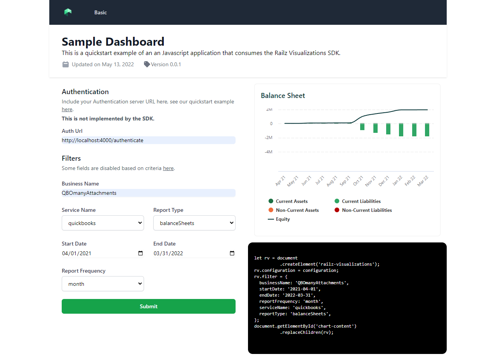

# Getting Started with Javascript Example

This project uses (Vanilla) Javascript and designed using [Tailwind CSS](https://tailwindcss.com/).
It demonstrates how to use railz visualizations with Javascript via script import from jsdelivr.net

## Usage

You can run directly the [index.html](index.html) file.

<i>Railz Visualizations SDK Javascript Usage Example.</i>

