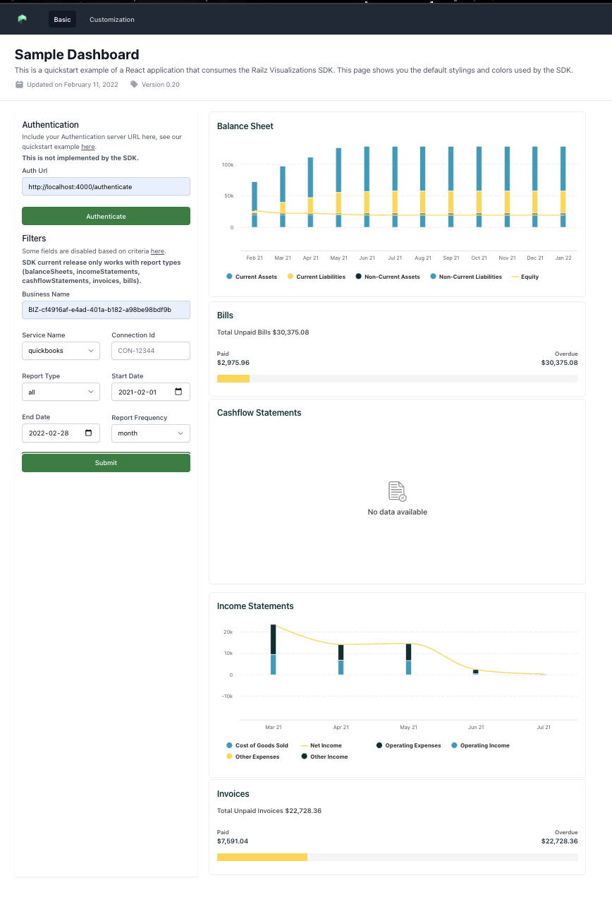

# Getting Started with React Example App

This project was bootstrapped with [Create React App](https://github.com/facebook/create-react-app) and designed using [Tailwind CSS](https://tailwindcss.com/).
It demonstrates how to setup railz visualizations with React via the `@railzai/railz-visualizations-react` package

## Usage

```bash
git clone https://github.com/railz-ai/railz-visualizations

cd railz-visualizations/examples/react-example

yarn install

yarn start
```


<p align="center"><i>Railz Visualizations SDK React Usage Example.</i></p>
