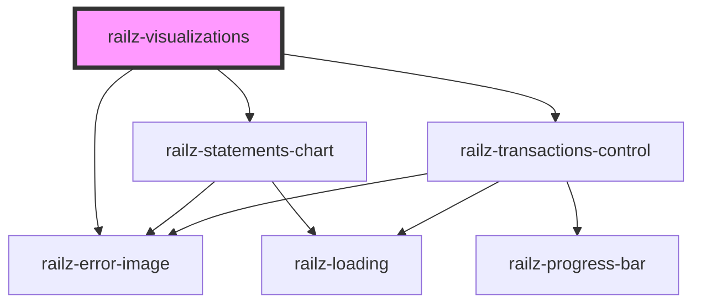

# railz-visualizations

<!-- Auto Generated Below -->

## Properties

| Property        | Attribute | Description | Type                                                                                                                                                                                                           | Default     |
| --------------- | --------- | ----------- | -------------------------------------------------------------------------------------------------------------------------------------------------------------------------------------------------------------- | ----------- |
| `configuration` | --        |             | `RVConfiguration`                                                                                                                                                                                              | `undefined` |
| `filter`        | --        |             | `RVBaseFilterBusinessDateFrequencyType \| RVBaseFilterBusinessDateType \| RVBaseFilterBusinessType \| RVBaseFilterConnectionDateFrequencyType \| RVBaseFilterConnectionDateType \| RVBaseFilterConnectionType` | `undefined` |
| `options`       | --        |             | `RVOptions`                                                                                                                                                                                                    | `undefined` |

## Dependencies

### Depends on

- [railz-error-image](../../elements/error)
- [railz-statements-chart](../statements-chart)
- [railz-transactions-control](../transactions-control)

### Graph

----------------------------------------------

*Built with [StencilJS](https://stenciljs.com/)*
