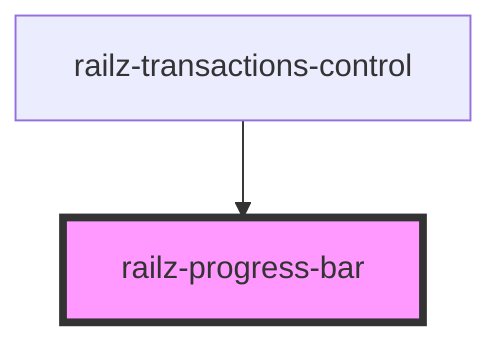

# railz-progress-bar

<!-- Auto Generated Below -->

## Properties

| Property        | Attribute        | Description | Type     | Default     |
| --------------- | ---------------- | ----------- | -------- | ----------- |
| `overdueAmount` | `overdue-amount` |             | `number` | `undefined` |
| `paidAmount`    | `paid-amount`    |             | `number` | `undefined` |
| `reportType`    | `report-type`    |             | `string` | `undefined` |
| `unpaidAmount`  | `unpaid-amount`  |             | `number` | `undefined` |

## Dependencies

### Used by

 - [railz-transactions-control](../transactions-control)

### Graph

----------------------------------------------

*Built with [StencilJS](https://stenciljs.com/)*
