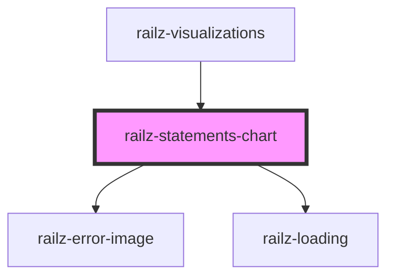

# railz-statements-chart

<!-- Auto Generated Below -->

## Properties

| Property                     | Attribute | Description | Type                                                                               | Default     |
| ---------------------------- | --------- | ----------- | ---------------------------------------------------------------------------------- | ----------- |
| `configuration` _(required)_ | --        |             | `RVConfiguration`                                                                  | `undefined` |
| `content`                    | --        |             | `RVContent`                                                                        | `undefined` |
| `filter` _(required)_        | --        |             | `RVBaseFilterBusinessDateFrequencyType \| RVBaseFilterConnectionDateFrequencyType` | `undefined` |
| `options`                    | --        |             | `RVOptions`                                                                        | `undefined` |

## Dependencies

### Used by

 - [railz-visualizations](../core)

### Depends on

- [railz-error-image](../../elements/error)
- [railz-loading](../../elements/loading)

### Graph

----------------------------------------------

*Built with [StencilJS](https://stenciljs.com/)*
