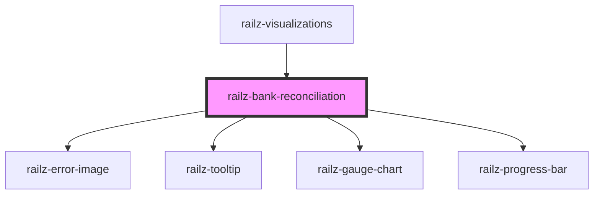

# railz-progress-bar

<!-- Auto Generated Below -->

## Properties

| Property                     | Attribute | Description                                                 | Type                         | Default     |
| ---------------------------- | --------- | ----------------------------------------------------------- | ---------------------------- | ----------- |
| `configuration` _(required)_ | --        | Configuration information like authentication configuration | `RVConfiguration`            | `undefined` |
| `filter` _(required)_        | --        | Filter information to query the backend APIs                | `RVFilterBankReconciliation` | `undefined` |
| `options`                    | --        | For whitelabeling styling                                   | `RVOptions`                  | `undefined` |

## Dependencies

### Used by

- [railz-visualizations](../core)

### Depends on

- [railz-error-image](../error)
- [railz-tooltip](../tooltip)
- [railz-gauge-chart](../gauge-chart)
- [railz-progress-bar](../progress-bar)

### Graph

---

_Built with [StencilJS](https://stenciljs.com/)_
