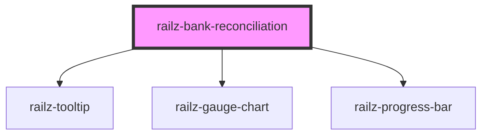

# railz-progress-bar

<!-- Auto Generated Below -->

## Properties

| Property              | Attribute              | Description                                                                                                                                                | Type                               | Default     |
| --------------------- | ---------------------- | ---------------------------------------------------------------------------------------------------------------------------------------------------------- | ---------------------------------- | ----------- |
| `accountingBalance`   | `accounting-balance`   | Accounting Balance                                                                                                                                         | `number`                           | `undefined` |
| `accuracyScore`       | `accuracy-score`       | The Accuracy Score is the precision level of reconciliation by taking into account the number of matched transactions and the value of those transactions. | `number`                           | `undefined` |
| `bankBalance`         | `bank-balance`         | Banking Balance                                                                                                                                            | `number`                           | `undefined` |
| `matchedTransactions` | `matched-transactions` | Matched Number of Transactions (exclude unmatched ones)                                                                                                    | `number`                           | `undefined` |
| `options`             | --                     | For whitelabeling styling                                                                                                                                  | `RVOptionsBankReconciliationStyle` | `undefined` |
| `totalTransations`    | `total-transations`    | Total Number of Transactions                                                                                                                               | `number`                           | `undefined` |

## Dependencies

### Depends on

- [railz-tooltip](../tooltip)
- [railz-gauge-chart](../gauge-chart)
- [railz-progress-bar](../progress-bar)

### Graph

---

_Built with [StencilJS](https://stenciljs.com/)_
