# railz-visualizations

<!-- Auto Generated Below -->

## Properties

| Property        | Attribute | Description                                                 | Type                                                                                                                                                                                                                                                 | Default     |
| --------------- | --------- | ----------------------------------------------------------- | ---------------------------------------------------------------------------------------------------------------------------------------------------------------------------------------------------------------------------------------------------- | ----------- |
| `configuration` | --        | Configuration information like authentication configuration | `RVConfiguration`                                                                                                                                                                                                                                    | `undefined` |
| `filter`        | --        | Filter information to query the backend APIs                | `RVFilterBalanceSheet \| RVFilterBankAccount \| RVFilterBills \| RVFilterCashflowStatements \| RVFilterCreditScore \| RVFilterDate \| RVFilterExpenses \| RVFilterFinancialRatio \| RVFilterIncomeStatements \| RVFilterInvoices \| RVFilterRevenue` | `undefined` |
| `options`       | --        | For whitelabeling styling                                   | `RVOptions`                                                                                                                                                                                                                                          | `undefined` |

## Dependencies

### Depends on

- [railz-error-image](../error)
- [railz-bank-accounts](../bank-accounts)
- [railz-financial-ratios](../financial-ratios)
- [railz-gauge-chart](../gauge-chart)
- [railz-pie-chart](../pie-chart)
- [railz-statements-chart](../statements-chart)
- [railz-transactions-control](../transactions-control)

### Graph

```mermaid
graph TD;
  railz-visualizations --> railz-error-image
  railz-visualizations --> railz-bank-accounts
  railz-visualizations --> railz-financial-ratios
  railz-visualizations --> railz-gauge-chart
  railz-visualizations --> railz-pie-chart
  railz-visualizations --> railz-statements-chart
  railz-visualizations --> railz-transactions-control
  railz-bank-accounts --> railz-error-image
  railz-bank-accounts --> railz-loading
  railz-bank-accounts --> railz-tooltip
  railz-financial-ratios --> railz-error-image
  railz-financial-ratios --> railz-loading
  railz-financial-ratios --> railz-tooltip
  railz-financial-ratios --> railz-percentage
  railz-financial-ratios --> railz-sparkline-chart
  railz-financial-ratios --> railz-select
  railz-gauge-chart --> railz-error-image
  railz-gauge-chart --> railz-loading
  railz-gauge-chart --> railz-gauge-chart-component
  railz-gauge-chart --> railz-tooltip
  railz-pie-chart --> railz-error-image
  railz-pie-chart --> railz-loading
  railz-pie-chart --> railz-tooltip
  railz-statements-chart --> railz-error-image
  railz-statements-chart --> railz-loading
  railz-statements-chart --> railz-tooltip
  railz-transactions-control --> railz-error-image
  railz-transactions-control --> railz-loading
  railz-transactions-control --> railz-progress-bar
  railz-transactions-control --> railz-tooltip
  style railz-visualizations fill:#f9f,stroke:#333,stroke-width:4px
```

---

_Built with [StencilJS](https://stenciljs.com/)_
