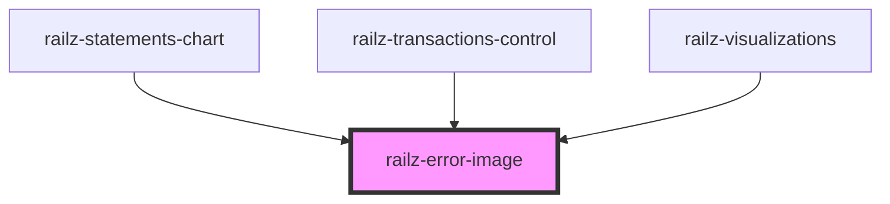

# railz-error-image

<!-- Auto Generated Below -->

## Properties

| Property     | Attribute     | Description                                            | Type     | Default     |
| ------------ | ------------- | ------------------------------------------------------ | -------- | ----------- |
| `fillColor`  | `fill-color`  | Fill color of the svg image representing a status code | `string` | `'#949494'` |
| `statusCode` | `status-code` | Status code based on HTTP Response codes               | `number` | `undefined` |
| `textColor`  | `text-color`  | Color of the image text                                | `string` | `'#424242'` |

## Dependencies

### Used by

- [railz-statements-chart](../../components/statements-chart)
- [railz-transactions-control](../../components/transactions-control)
- [railz-visualizations](../../components/core)

### Graph

---

_Built with [StencilJS](https://stenciljs.com/)_
