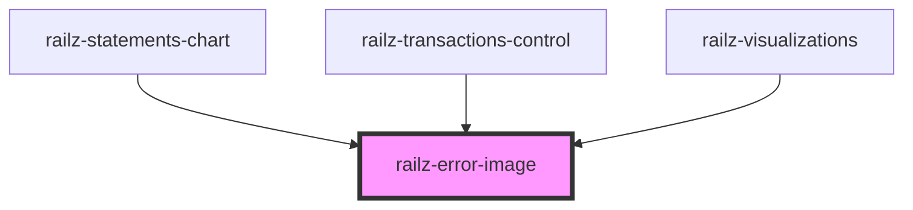

# railz-error-image

<!-- Auto Generated Below -->

## Properties

| Property                  | Attribute     | Description | Type     | Default     |
| ------------------------- | ------------- | ----------- | -------- | ----------- |
| `message`                 | `message`     |             | `string` | `""`        |
| `statusCode` _(required)_ | `status-code` |             | `number` | `undefined` |

## Dependencies

### Used by

 - [railz-statements-chart](../../components/statements-chart)
 - [railz-transactions-control](../../components/transactions-control)
 - [railz-visualizations](../../components/core)

### Graph

----------------------------------------------

*Built with [StencilJS](https://stenciljs.com/)*
