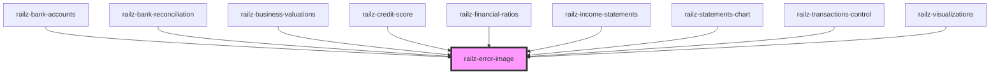

# railz-error-image

<!-- Auto Generated Below -->

## Properties

| Property     | Attribute     | Description                                            | Type                      | Default     |
| ------------ | ------------- | ------------------------------------------------------ | ------------------------- | ----------- |
| `fillColor`  | `fill-color`  | Fill color of the svg image representing a status code | `string`                  | `'#949494'` |
| `height`     | `height`      | Height of the SVG Error Indicator                      | `string`                  | `undefined` |
| `statusCode` | `status-code` | Status code based on HTTP Response codes               | `number`                  | `undefined` |
| `textStyle`  | --            | Style of the image text                                | `{ [key: string]: any; }` | `undefined` |
| `width`      | `width`       | Width of the SVG Error Indicator                       | `string`                  | `undefined` |

## Dependencies

### Used by

 - [railz-bank-accounts](../bank-accounts)
 - [railz-bank-reconciliation](../bank-reconciliation)
 - [railz-business-valuations](../business-valuations)
 - [railz-credit-score](../credit-score)
 - [railz-financial-ratios](../financial-ratios)
 - [railz-income-statements](../income-statements)
 - [railz-statements-chart](../statements-chart)
 - [railz-transactions-control](../transactions-control)
 - [railz-visualizations](../core)

### Graph

----------------------------------------------

*Built with [StencilJS](https://stenciljs.com/)*
