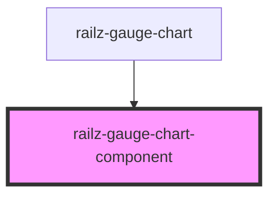

# railz-gauge-chart-component

<!-- Auto Generated Below -->

## Properties

| Property               | Attribute | Description                     | Type                  | Default     |
| ---------------------- | --------- | ------------------------------- | --------------------- | ----------- |
| `data` _(required)_    | --        | Data to display for gauge chart | `RVGaugeChartSummary` | `undefined` |
| `options` _(required)_ | --        | Options for gauge chart         | `RVOptions`           | `undefined` |

## Dependencies

### Used by

- [railz-gauge-chart](..)

### Graph

---

_Built with [StencilJS](https://stenciljs.com/)_
