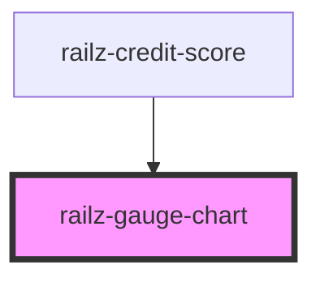

# railz-gauge-chart

<!-- Auto Generated Below -->

## Properties

| Property  | Attribute | Description               | Type                   | Default     |
| --------- | --------- | ------------------------- | ---------------------- | ----------- |
| `data`    | --        |                           | `RVCreditScoreSummary` | `undefined` |
| `options` | --        | For whitelabeling styling | `RVOptions`            | `undefined` |

## Dependencies

### Used by

- [railz-credit-score](../credit-score)

### Graph

---

_Built with [StencilJS](https://stenciljs.com/)_
