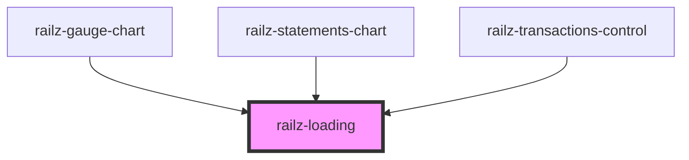

# railz-loading

<!-- Auto Generated Below -->

## Properties

| Property      | Attribute      | Description                                            | Type     | Default               |
| ------------- | -------------- | ------------------------------------------------------ | -------- | --------------------- |
| `fillColor`   | `fill-color`   | Fill color of the loading indicator                    | `string` | `RAILZ_PRIMARY_COLOR` |
| `loadingText` | `loading-text` | Text to display at the bottom of the loading indicator | `string` | `undefined`           |
| `textColor`   | `text-color`   | Color of the loading text                              | `string` | `'#000000'`           |

## Dependencies

### Used by

- [railz-gauge-chart](../../components/gauge-chart)
- [railz-statements-chart](../../components/statements-chart)
- [railz-transactions-control](../../components/transactions-control)

### Graph

---

_Built with [StencilJS](https://stenciljs.com/)_
