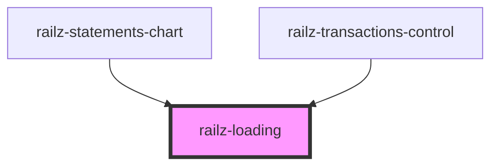

# railz-loading

<!-- Auto Generated Below -->

## Properties

| Property      | Attribute      | Description | Type     | Default     |
| ------------- | -------------- | ----------- | -------- | ----------- |
| `loadingText` | `loading-text` |             | `string` | `undefined` |

## Dependencies

### Used by

 - [railz-statements-chart](../../components/statements-chart)
 - [railz-transactions-control](../../components/transactions-control)

### Graph

----------------------------------------------

*Built with [StencilJS](https://stenciljs.com/)*
