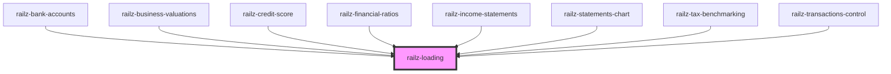

# railz-loading

<!-- Auto Generated Below -->

## Properties

| Property      | Attribute      | Description                                            | Type                      | Default               |
| ------------- | -------------- | ------------------------------------------------------ | ------------------------- | --------------------- |
| `fillColor`   | `fill-color`   | Fill color of the loading indicator                    | `string`                  | `RAILZ_PRIMARY_COLOR` |
| `height`      | `height`       | Height of the SVG Loading Indicator                    | `string`                  | `'48px'`              |
| `loadingText` | `loading-text` | Text to display at the bottom of the loading indicator | `string`                  | `undefined`           |
| `textStyle`   | --             | Style of the text                                      | `{ [key: string]: any; }` | `undefined`           |
| `width`       | `width`        | Width of the SVG Loading Indicator                     | `string`                  | `'48px'`              |

## Dependencies

### Used by

- [railz-bank-accounts](../bank-accounts)
- [railz-business-valuations](../business-valuations)
- [railz-credit-score](../credit-score)
- [railz-financial-ratios](../financial-ratios)
- [railz-income-statements](../income-statements)
- [railz-statements-chart](../statements-chart)
- [railz-tax-benchmarking](../tax-benchmarking)
- [railz-transactions-control](../transactions-control)

### Graph

---

_Built with [StencilJS](https://stenciljs.com/)_
