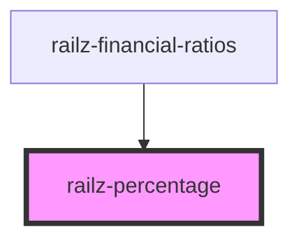

# railz-progress-bar

<!-- Auto Generated Below -->

## Properties

| Property                  | Attribute    | Description        | Type     | Default     |
| ------------------------- | ------------ | ------------------ | -------- | ----------- |
| `percentage` _(required)_ | `percentage` | Percentage to show | `number` | `undefined` |

## Dependencies

### Used by

- [railz-financial-ratios](../financial-ratios)

### Graph

---

_Built with [StencilJS](https://stenciljs.com/)_
