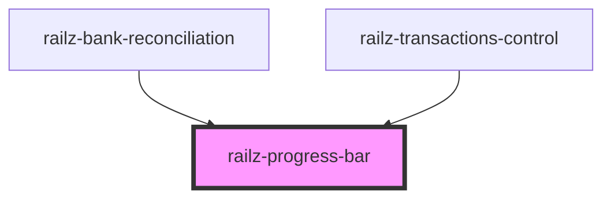

# railz-progress-bar

<!-- Auto Generated Below -->

## Properties

| Property        | Attribute        | Description                              | Type                                            | Default     |
| --------------- | ---------------- | ---------------------------------------- | ----------------------------------------------- | ----------- |
| `options`       | --               | For whitelabeling styling                | `RVOptionsBarStyle`                             | `undefined` |
| `overdueAmount` | `overdue-amount` | For overdue amount of an invoice or bill | `number`                                        | `undefined` |
| `paidAmount`    | `paid-amount`    | For paid amount of an invoice or bill    | `number`                                        | `undefined` |
| `reportType`    | `report-type`    | To indicate if its an invoice or bill    | `RVReportTypes.BILLS \| RVReportTypes.INVOICES` | `undefined` |
| `unpaidAmount`  | `unpaid-amount`  | For unpaid amount of an invoice or bill  | `number`                                        | `undefined` |

## Dependencies

### Used by

 - [railz-bank-reconciliation](../bank-reconciliation)
 - [railz-transactions-control](../transactions-control)

### Graph

----------------------------------------------

*Built with [StencilJS](https://stenciljs.com/)*
