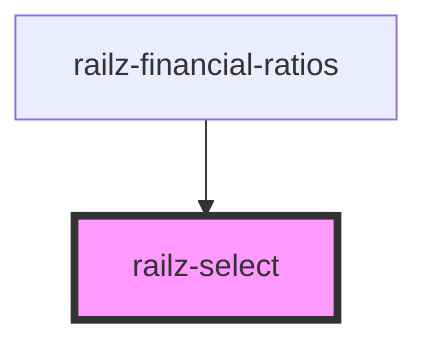

# railz-select

<!-- Auto Generated Below -->

## Properties

| Property      | Attribute | Description                             | Type            | Default                                                       |
| ------------- | --------- | --------------------------------------- | --------------- | ------------------------------------------------------------- |
| `items`       | --        | The items to be listed                  | `string[]`      | `['Efficiency', 'Liquidity', 'Profitability', 'Reliability']` |
| `selectStyle` | --        | Position of the Select text when opened | `RVSelectStyle` | `{ position: 'right' }`                                       |

## Events

| Event          | Description | Type                  |
| -------------- | ----------- | --------------------- |
| `selectedItem` |             | `CustomEvent<number>` |

## Dependencies

### Used by

- [railz-financial-ratios](../financial-ratios)

### Graph

---

_Built with [StencilJS](https://stenciljs.com/)_
