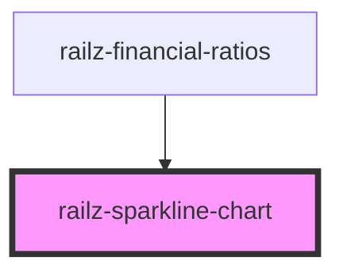

# railz-sparkline-chart

<!-- Auto Generated Below -->

## Properties

| Property            | Attribute | Description                   | Type                           | Default     |
| ------------------- | --------- | ----------------------------- | ------------------------------ | ----------- |
| `data` _(required)_ | --        | Data to display for sparkline | `RVPeriodData[]`               | `undefined` |
| `sparkLineStyle`    | --        |                               | `RVOptionsRatioSparkLineStyle` | `undefined` |

## Dependencies

### Used by

- [railz-financial-ratios](../financial-ratios)

### Graph

---

_Built with [StencilJS](https://stenciljs.com/)_
