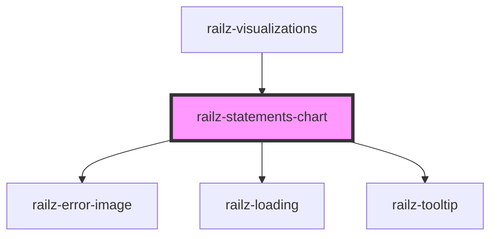

# railz-statements-chart

<!-- Auto Generated Below -->

## Usage

### Angular

```html
<railz-statements-chart
  [configuration]='{
    "token": "your token..."
}'
  [filter]='{
    "startDate": "2021-03-01",
    "endDate": "2021-12-31",
    "businessName": "your business name...",
    "reportType": "balanceSheets",
    "serviceName": "sandbox",
    "reportFrequency": "month"
}'
></railz-statements-chart>
```

### React

```typescript jsx
import { RailzStatementsChart } from '@railzai/railz-visualizations-react';

<RailzStatementsChart
  configuration={{
    token: 'your token...',
  }}
  filter={{
    startDate: '2021-03-01',
    endDate: '2021-12-31',
    reportFrequency: 'month',
    reportType: 'balanceSheets',
    businessName: 'your business name...',
    serviceName: 'quickbooks',
  }}
/>;
```

## Properties

| Property                     | Attribute | Description                                                 | Type                                                                                                           | Default     |
| ---------------------------- | --------- | ----------------------------------------------------------- | -------------------------------------------------------------------------------------------------------------- | ----------- |
| `configuration` _(required)_ | --        | Configuration information like authentication configuration | `RVConfiguration`                                                                                              | `undefined` |
| `filter` _(required)_        | --        | Filter information to query the backend APIs                | `RVFilterBalanceSheet \| RVFilterCashflowStatements \| RVFilterFinancialForecasts \| RVFilterIncomeStatements` | `undefined` |
| `options`                    | --        | For whitelabeling styling                                   | `RVOptions`                                                                                                    | `undefined` |

## Dependencies

### Used by

- [railz-visualizations](../core)

### Depends on

- [railz-error-image](../error)
- [railz-loading](../loading)
- [railz-tooltip](../tooltip)

### Graph



---

_Built with [StencilJS](https://stenciljs.com/)_
