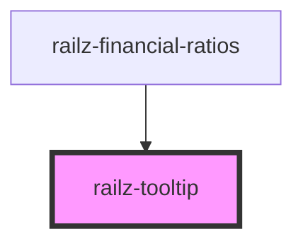

# railz-progress-bar

<!-- Auto Generated Below -->

## Properties

| Property                   | Attribute      | Description                       | Type     | Default     |
| -------------------------- | -------------- | --------------------------------- | -------- | ----------- |
| `text`                     | `text`         | Question mark with a tooltip text | `string` | `''`        |
| `tooltipText` _(required)_ | `tooltip-text` |                                   | `string` | `undefined` |

## Dependencies

### Used by

- [railz-financial-ratios](../financial-ratios)

### Graph

---

_Built with [StencilJS](https://stenciljs.com/)_
