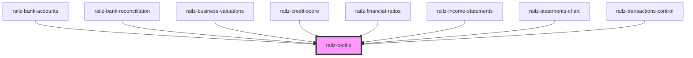

# railz-tooltip

<!-- Auto Generated Below -->

## Properties

| Property                   | Attribute      | Description                               | Type                      | Default                         |
| -------------------------- | -------------- | ----------------------------------------- | ------------------------- | ------------------------------- |
| `text`                     | `text`         | Question mark with a tooltip text         | `string`                  | `''`                            |
| `tooltipStyle`             | --             | Position of the Tooltip text when hovered | `RVTooltipIndicatorStyle` | `{ position: 'bottom-center' }` |
| `tooltipText` _(required)_ | `tooltip-text` |                                           | `string`                  | `undefined`                     |

## Dependencies

### Used by

- [railz-bank-accounts](../bank-accounts)
- [railz-bank-reconciliation](../bank-reconciliation)
- [railz-business-valuations](../business-valuations)
- [railz-credit-score](../credit-score)
- [railz-financial-ratios](../financial-ratios)
- [railz-income-statements](../income-statements)
- [railz-statements-chart](../statements-chart)
- [railz-transactions-control](../transactions-control)

### Graph

---

_Built with [StencilJS](https://stenciljs.com/)_
